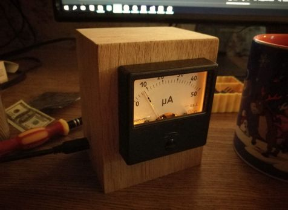

# monitor9000 



This makes ancient Soviet ammeter display CPU load using Arduino. It can potentially display anything and have some kind of GUI but I didn't bother to implement it yet. 

## Installing
```
pip install -r requirements.txt
```